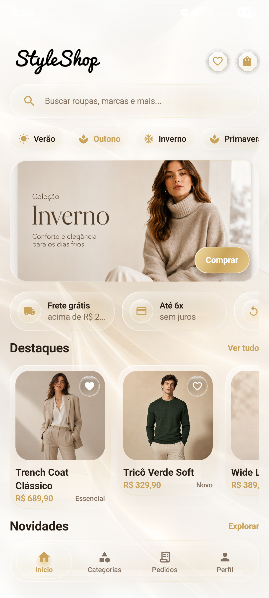
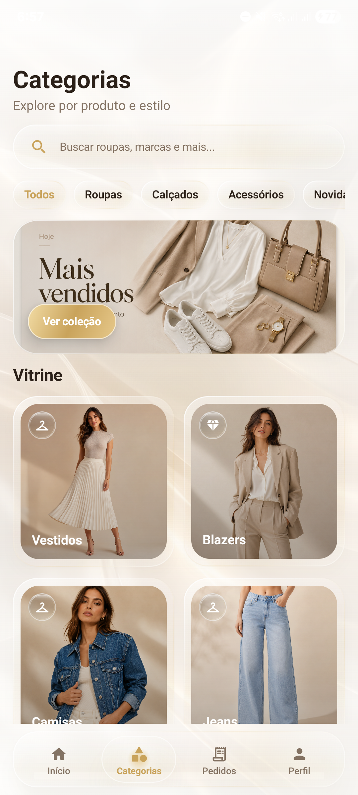
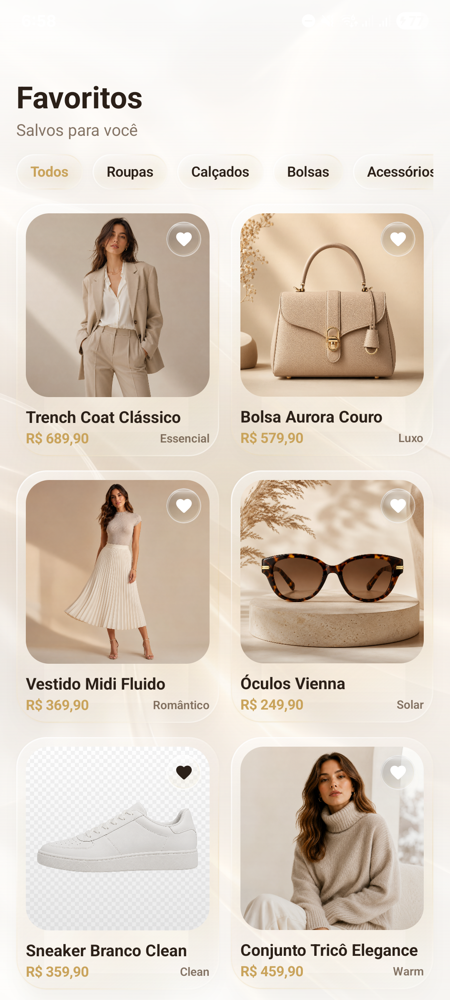
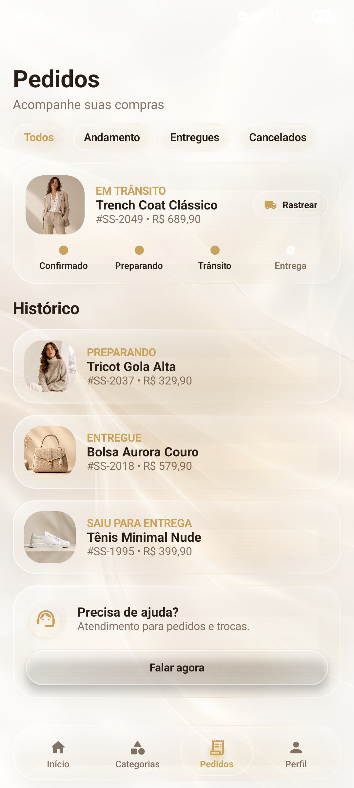
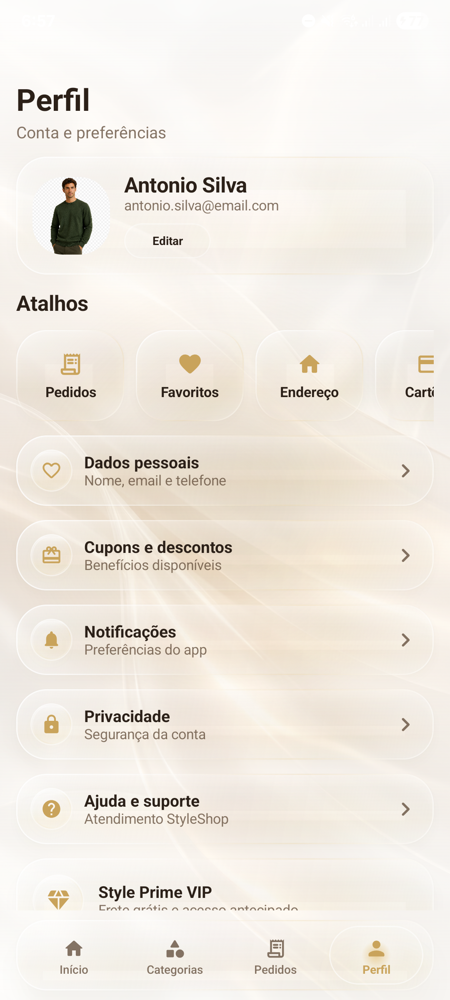

# StyleShopUIDemo

StyleShopUIDemo is a premium Android UI demo for a fashion e-commerce app, built with Kotlin and Jetpack Compose. The project focuses on visual polish, glassmorphism, smooth interactions and a realistic shopping flow using local mock data.

The app simulates a modern clothing store experience with home, categories, product details, favorites, shopping bag, checkout, order tracking and profile screens. It does not use a real backend, login, payment gateway or delivery service. The goal is to showcase UI/UX, component architecture and a refined mobile design system.

## Preview

Screenshots captured from the app running on a physical Android device.

| Home | Categories | Favorites |
| --- | --- | --- |
|  |  |  |

| Orders | Profile |
| --- | --- |
|  |  |

## Highlights

- Premium fashion-store interface inspired by Liquid Glass and glassmorphism
- Custom design system with ivory, champagne, gold and soft brown tones
- Reusable Compose components for glass cards, buttons, chips, product cards and navigation
- Bottom navigation with a sliding active indicator
- Session-based fake shopping bag with item count, quantity controls and calculated totals
- Product detail, checkout and fake order confirmation flow
- Favorites screen available as an internal route
- Placeholder products with shimmer-style loading behavior
- Local asset library for products, banners, categories, logo and app visuals
- Motion-focused UI with press feedback, scale animations and soft transitions

## Tech Stack

- Kotlin
- Jetpack Compose
- Material 3
- Navigation Compose
- ViewModel
- Coil / AsyncImage
- Gradle Kotlin DSL

## Main Screens

- **Home:** logo, search bar, categories carousel, hero banner, benefit cards and product sections
- **Categories:** filters, category grid, collection banner and style shortcuts
- **Product Details:** product image, favorite action, size selector and add-to-bag actions
- **Favorites:** saved products with glass cards and wishlist section
- **Bag:** session cart with quantity controls, remove action and subtotal
- **Checkout:** fake order summary, discount, total and confirmation action
- **Orders:** order history, progress tracking and support actions
- **Profile:** user card, shortcuts, account options and VIP membership block

## Project Structure

```text
app/
  src/main/java/com/styleshopuidemo/
    data/
      DemoData.kt
      StyleShopViewModel.kt
    navigation/
      AppNavigation.kt
    ui/
      components/
      screens/
      theme/
    MainActivity.kt

app/src/main/res/drawable-nodpi/
  local images used by the demo

docs/app_screenshots/
  real screenshots captured from the running app
```

## Assets

The images used by the Android app are organized in:

```text
app/src/main/res/drawable-nodpi/
```

File names were normalized to follow Android resource naming rules, using lowercase letters, numbers and underscores.

## How To Run

1. Clone or download the repository.
2. Open the project folder in Android Studio.
3. Wait for Gradle Sync to finish.
4. Select an emulator or physical Android device.
5. Click **Run**.

You can also build from the terminal:

```powershell
.\gradlew.bat assembleDebug
```

The debug APK is saved at:

```text
app/build/outputs/apk/debug/app-debug.apk
```

Android Studio recreates the local SDK configuration automatically when the project is opened.

## Important Notes

This is a visual and academic demo. The shopping bag, checkout, favorites and orders are simulated in the current app session only.

Jetpack Compose does not provide the same native background blur behavior as iOS Liquid Glass on every Android version. This project recreates the visual feeling with translucent layers, gradients, soft borders, shadows, highlights and motion effects.

## Status

The app is currently focused on UI polish, navigation flow and fake e-commerce behavior. Future improvements could include real authentication, backend integration, persistent cart storage, payment simulation and accessibility refinements.
